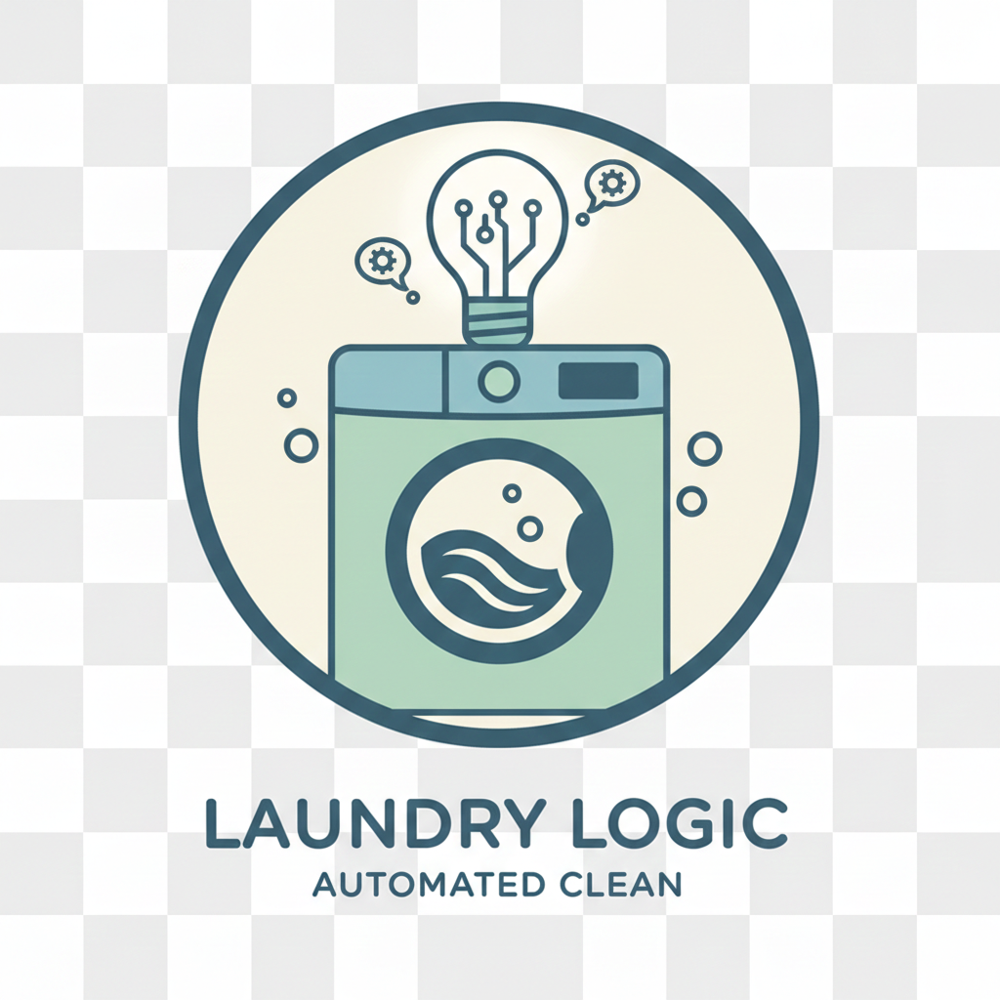

  

# 🧺 Laundry Logic: Automated Clean
### 🧾 Financial Modules
- **Accounts Receivable (AR):** Automatically tracks unpaid customer orders and calculates expected incoming cash.
- **Accounts Payable (AP):** Monitors business expenses and upcoming bills to manage shop overhead.
- **Cash Flow Analysis:** Provides a "Net Cash Position" to determine the business's current financial health.
### 🚨 Intelligent Alerts
The system includes a **Liquidity Check** module. If the shop's Accounts Payable exceeds its Receivable, the system triggers a `SAFETY ALERT`, calculating the exact "Cash Gap" needed to maintain business operations.
### 🏦 Module: Bank Reconciliation
This professional bookkeeping module compares internal sales records against external bank statements.
- **Automated Verification:** Matches total "Paid" orders against actual bank deposits.
- **Discrepancy Detection:** Flags differences immediately to prevent fraud or accounting errors.
- **Audit Ready:** Ensures that the digital ledger and real-world cash are always in sync.

---

## 📖 User Manual & Operations Guide

### 📂 Step 1: Data Entry
The system is powered by three main "Ledgers" (CSV files). You can update these using Excel or by editing them directly here on GitHub:
* **`laundry_orders.csv`**: Log new customers, weights, and service types.
* **`expenses.csv`**: Record shop overhead like rent and utilities.
* **`bank_statement.csv`**: Paste your bank/GCash transaction history for reconciliation.

### ⚙️ Step 2: Processing Orders
When a customer picks up their laundry:
1. Open `laundry_orders.csv`.
2. Update **Status** to `Ready`.
3. Update **PaymentStatus** to `Paid`.
4. Click **Commit Changes** to save.

### 🤖 Step 3: View Automated Reports
You don't need to calculate anything manually! 
1. Click the **Actions** tab at the top of this repo.
2. Select the latest **"Laundry Shop Daily Report"**.
3. Expand the **"Run Laundry System"** or **"Run Bank Reconciliation"** steps to see the printed financial dashboard and health alerts.

### 🚨 Troubleshooting
* **Discrepancy Found?** Check if a payment was marked "Paid" in the orders file but is missing from the bank statement.
* **Safety Alert?** This means your unpaid bills (Payable) are higher than your expected income (Receivable). Time to collect those payments!
